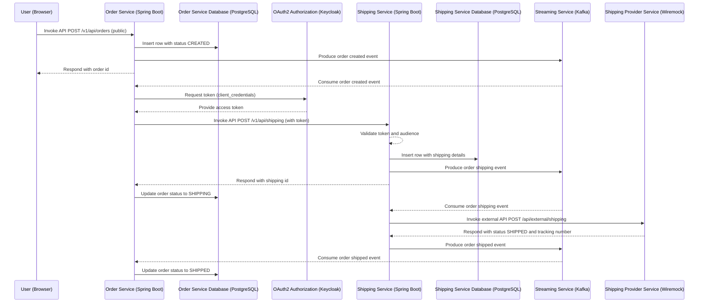

# [Intesys Codylab Innovation: All You Can Fix! 🛠️🐞](https://www.intesys.it/lavora-con-noi/all-you-can-fix-challenge/)

Immagina di entrare in un nuovo ambiente di lavoro e di trovarti subito immerso in un progetto avviato, ma... con **diverse cose da sistemare**! In questa sfida, ti troverai a risolvere bug su un’applicazione reale costruita con **Spring Boot, Keycloak, Kafka, PostgreSQL e Docker**. 

Ci sono **almeno 10 bug nascosti** nel codice e il tuo obiettivo è scovarli, correggerli e portare il progetto a un livello di performance ottimale.

### 💡 Cosa Devi Fare
Il tuo compito è individuare e correggere quanti più bug possibile migliorando la qualità e la pulizia del codice. Ogni tua azione sarà valutata in base a:
- **Numero di correzioni effettuate**
- **Bontà e solidità delle soluzioni proposte**
- **Gestione ordinata e collaborativa del repository**
- **Pulizia e leggibilità del codice**
- **Tempo di consegna** (prima completi, meglio è!)

#### Nota Bene
Per efficientare la fase di verifica/correzione cerca di non stravolgere il codice con formatting strani ci aiuterà a capire meglio le modifiche inserite.

###  🏆 [Premi Principali](https://www.intesys.it/lavora-con-noi/all-you-can-fix-challenge/)
1. **Oro del Debugger Supremo** - Per il primo classificato che ha risolto più bug nel minor tempo.
2. **Argento del Fixer Esperto** - Per il secondo miglior partecipante, con ottime soluzioni.
3. **Bronzo del Risolutore Rapido** - Per il terzo posto, premiando velocità e precisione.

### 🏆 [Premi Speciali](https://www.intesys.it/lavora-con-noi/all-you-can-fix-challenge/)
Oltre ai premi principali, riconosceremo i partecipanti con badge speciali:
- **Sherlock del Codice** 🕵️‍♂️🔍 – per chi saprà individuare i bug più nascosti con un approccio da vero detective
- **Hacker del Refactoring** 🔧💥 – per chi, oltre a correggere, porterà il codice a un livello di pulizia e qualità superiore

Pronto a dimostrare le tue capacità? Accetta la sfida, esplora il codice, e porta il progetto alla massima efficienza. Buon fixing!

## 💼📆 Modalità di consegna
Dovrai inviare entro il 5 dicembre uno zip con il tuo elaborato al seguente indirizzo: **codylabchallenge@intesys.it**.

Lo zip può contenere anche solo la cartella .git l'importante è che sia chiaro e valutabile quali sono i bug corretti e gli interventi necessari per correggerli.

In caso di zip non corretto o non usabile la sfida non verrà presa in considerazione.

In caso ci fossero **problemi ad allegare lo zip alla mail** può essere usato anche uno strumento come wetransfer o simili per generare un link di download.

## 🎢🛒 Diagramma ciclo di vita ordine

Di seguito un diagramma di sequenza che rispecchia l'architettura e il flusso di creazione di un ordine:

## 🎯 Use Cases

La sfida prevede la correzione e l'ottimizzazione di due flussi principali, entrambi gestibili tramite gli endpoint esposti da **OrderService** e testabili direttamente tramite la sua interfaccia **Swagger-UI** (senza necessità di autenticazione/autorizzazione).

### 🛒 Creazione di un Singolo Ordine
- **Endpoint**: `POST /api/orders`
- Questo flusso consente di simulare la creazione di un singolo ordine. L'obiettivo è garantire che l'operazione venga eseguita correttamente, senza errori e con la gestione adeguata delle eventuali anomalie.

### 📦 Inserimento Bulk di Ordini (1000 ordini)
- **Endpoint**: `POST /api/orders/bulk`
- Questo flusso è progettato per gestire l'inserimento massivo di **1000 ordini** in un'unica operazione. Deve garantire che:
    - Non vengano inseriti ordini duplicati (un ordine è considerato duplicato se ha gli stessi dati di un altro).
    - Le performance siano adeguate anche con un alto volume di richieste.

**Nota:** Entrambi gli endpoint sono pronti per essere testati tramite **Swagger-UI**, consentendoti di concentrarti esclusivamente sul fixing e l’ottimizzazione delle funzionalità. Identifica i bug e migliora i flussi per ottenere un’applicazione solida ed efficiente. Buon lavoro! 🚀

